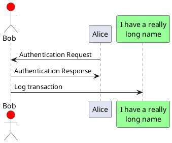

# UML

Markdown Preview Enhanced 對 Markdown 按 Ctrl-K-V 可以預覽

PlantUML 的副檔名必須要是 puml 才能正確顯示。(預覽用 Alt-D)

## Activity Diagram

@import "activity.puml"

## Sequence Diagram

```puml
@startuml
actor Bob #red
' The only difference between actor
'and participant is the drawing
participant Alice
participant "I have a really\nlong name" as L #99FF99
/' You can also declare:
   participant L as "I have a really\nlong name"  #99FF99
  '/

Alice->Bob: Authentication Request
Bob->Alice: Authentication Response
Bob->L: Log transaction
@enduml
```

