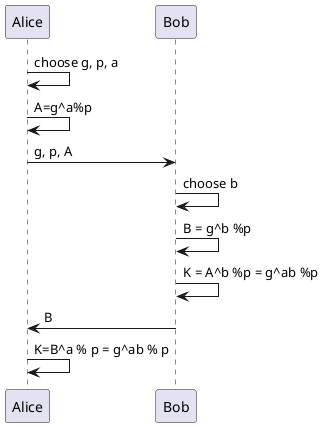

# Diffie Hallman Key Exchange

## 執行

```
$ node .\diffieHellman.js
Alice.K = 2
Bob.K   = 2
```

## 原理

* [維基百科:迪菲-赫爾曼密鑰交換](https://zh.wikipedia.org/wiki/%E8%BF%AA%E8%8F%B2-%E8%B5%AB%E7%88%BE%E6%9B%BC%E5%AF%86%E9%91%B0%E4%BA%A4%E6%8F%9B) (讚！)
* [Public key cryptography: What is it?](https://www.khanacademy.org/computing/computer-science/cryptography/modern-crypt/v/diffie-hellman-key-exchange-part-1)
* [Diffie-hellman key exchange](https://www.khanacademy.org/computing/computer-science/cryptography/modern-crypt/v/diffie-hellman-key-exchange-part-2)


## 數學

定理： $(g^a)^b = g^{ab} = (g^b)^a (mod\;p)$




<!--
(g^a %p)^b %p = g^{ab} %p = (g^b %p)^a %p

```
Alice                       Bob
a, g, p                     b
A = g^a % p    =(g,p,A)=>   B = g^b % p
K = B^a % p     <=(B)=      K = A^b % p
  = g^ab %p                   = g^ab %p
```
-->

