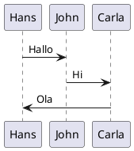
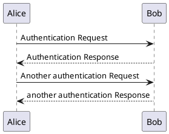
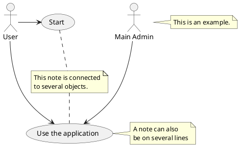
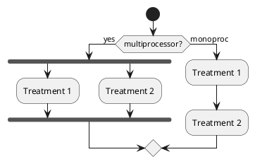
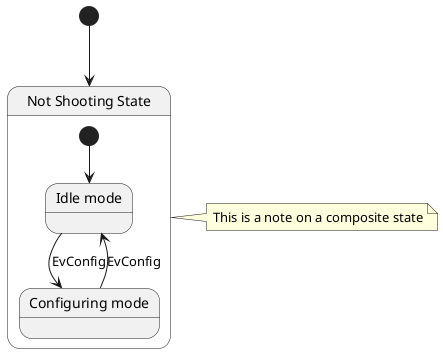
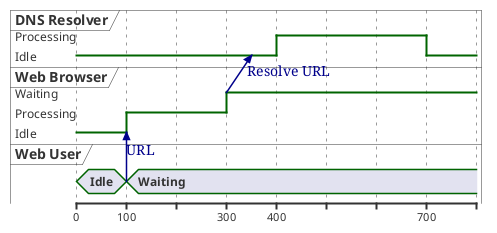
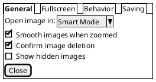
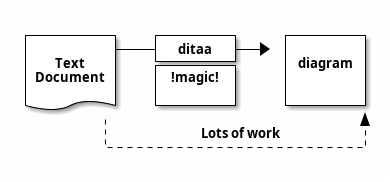
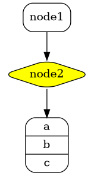

# UML

## Sequence 1

```puml
@startuml
Hans -> John : Hallo
John -> Carla : Hi
Carla -> Hans : Ola
@enduml
```

## Sequence 2

```puml
@startuml
Alice -> Bob: Authentication Request
Bob --> Alice: Authentication Response

Alice -> Bob: Another authentication Request
Alice <-- Bob: another authentication Response
@enduml
```

## Use Case 1

```puml
@startuml
:Main Admin: as Admin
(Use the application) as (Use)

User -> (Start)
User --> (Use)

Admin ---> (Use)

note right of Admin : This is an example.

note right of (Use)
  A note can also
  be on several lines
end note

note "This note is connected\nto several objects." as N2
(Start) .. N2
N2 .. (Use)
@enduml
```

## Activity Diagram

```puml
@startuml

start

if (multiprocessor?) then (yes)
  fork
    :Treatment 1;
  fork again
    :Treatment 2;
  end fork
else (monoproc)
  :Treatment 1;
  :Treatment 2;
endif

@enduml
```

## State Diagram

```puml
@startuml

[*] --> NotShooting

state "Not Shooting State" as NotShooting {
  state "Idle mode" as Idle
  state "Configuring mode" as Configuring
  [*] --> Idle
  Idle --> Configuring : EvConfig
  Configuring --> Idle : EvConfig
}

note right of NotShooting : This is a note on a composite state

@enduml
```

## Gantt Chart

```puml
@startgantt
[Prototype design] lasts 13 days
[Test prototype] lasts 4 days
[Test prototype] starts at [Prototype design]'s end
[Prototype design] is colored in Fuchsia/FireBrick 
[Test prototype] is colored in GreenYellow/Green 
@endgantt
```

## Timing Diagram

```puml
@startuml
robust "DNS Resolver" as DNS
robust "Web Browser" as WB
concise "Web User" as WU

@0
WU is Idle
WB is Idle
DNS is Idle

@+100
WU -> WB : URL
WU is Waiting
WB is Processing

@+200
WB is Waiting
WB -> DNS@+50 : Resolve URL

@+100
DNS is Processing

@+300
DNS is Idle
@enduml
```

## Salt UI

```puml
@startsalt
{+
{/ <b>General | Fullscreen | Behavior | Saving }
{
	{ Open image in: | ^Smart Mode^ }
	[X] Smooth images when zoomed
	[X] Confirm image deletion
	[ ] Show hidden images
}
[Close]
}
@endsalt
```

## Ditaa

```puml
@startditaa
+--------+   +-------+    +-------+
|        +---+ ditaa +--> |       |
|  Text  |   +-------+    |diagram|
|Document|   |!magic!|    |       |
|     {d}|   |       |    |       |
+---+----+   +-------+    +-------+
	:                         ^
	|       Lots of work      |
	+-------------------------+
@endditaa
```

## DOT

```puml
@startdot
digraph foo {
  node [style=rounded]
  node1 [shape=box]
  node2 [fillcolor=yellow, style="rounded,filled", shape=diamond]
  node3 [shape=record, label="{ a | b | c }"]

  node1 -> node2 -> node3
}
@enddot
```

